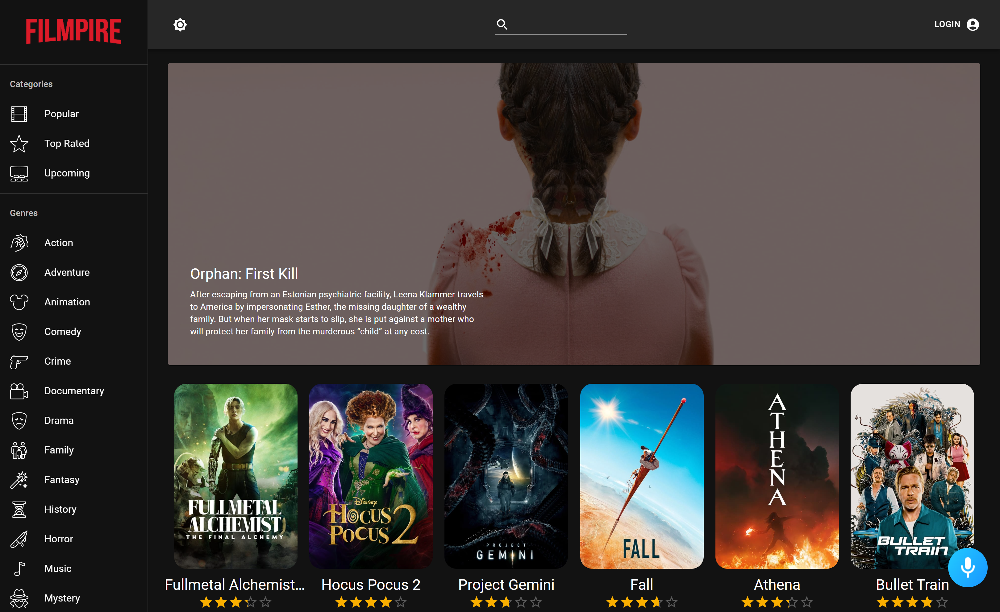

<h1 align="center">
  FILMPIRE
</h1>
 

 

  Filmpire Is a Netflix Clone With IMDB Features, the Filmpire app combines the industry's most advanced JavaScript tools including React.js, Material UI, Alan AI, and more.

 
<h1 align="center">
  Tech stack
</h1>
 

  Inside the Filmpire app, I worked with the most modern, and in-demand technologies in the JavaScript ecosystem, such as React.js, Material UI, Redux, Alan AI, CSS, and more!

  
  
 A JavaScript library for building   user interfaces 

  &#8287;&#8287;&#8287;&#8287;&#8287;
  
  
 A JavaScript library for building   user interfaces 

  &#8287;&#8287;&#8287;&#8287;&#8287;
    

